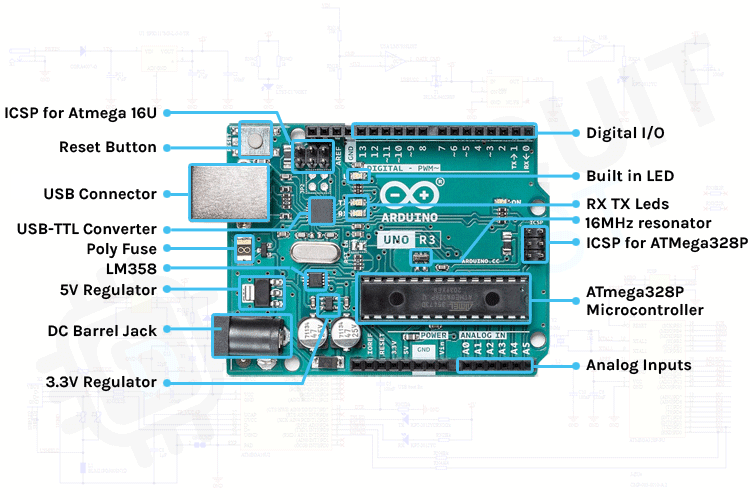
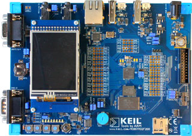

# Real-time-programming-on-micro-controllers
The project deals with real-time programming of Arduino board and Keil board.
Tasks like Warmup basics of Arduino, TimeSlicing in Arduino, PWM - Control Arduino + FreeRTOS, PingPong on ARM, Multitasking on Keil board, and finally MessageQueue on Keil board.
  
The Arduino Uno is attached to a breadboard where the components can be connected to the Arduino board and programmed. Eclipse IDE was used to program the Arduino and Keil board in C language. Each task folder will contain a README file for task description. 
 

