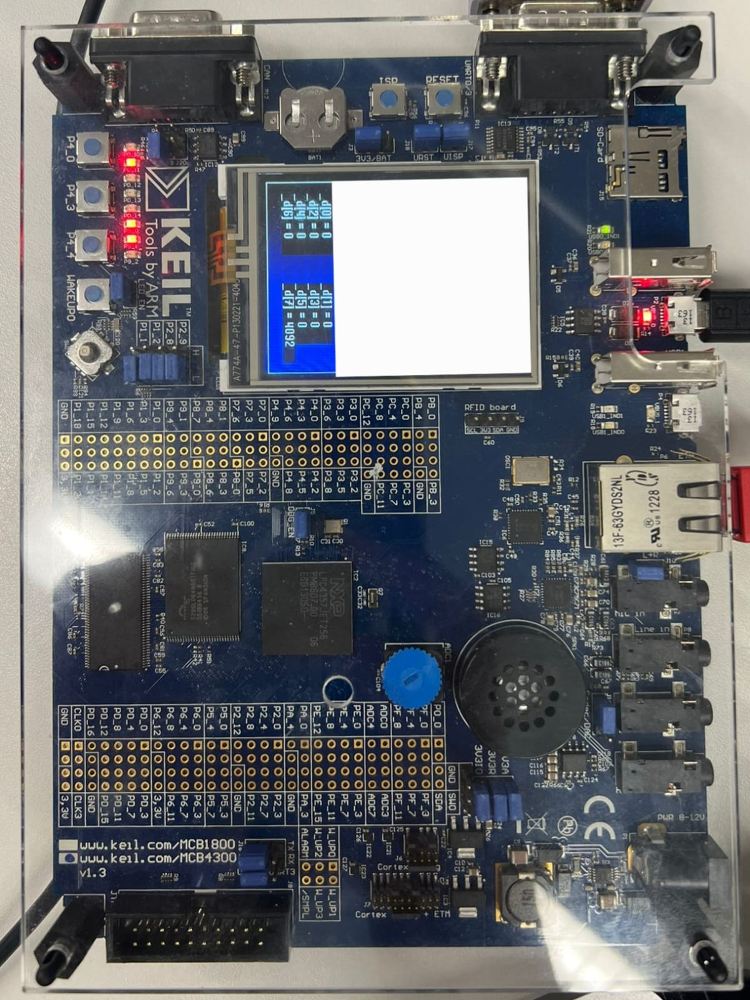

# Real-time-programming-on-micro-controllers
The project deals with real-time programming of Arduino board and Keil board.
Tasks like Warmup basics of Arduino, TimeSlicing in Arduino, PWM - Control Arduino + FreeRTOS, PingPong on ARM, Multitasking on Keil board, and finally MessageQueue on Keil board.

